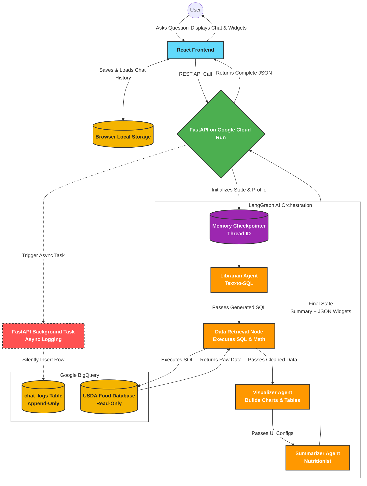

Markdown
# 🥗 AI Nutrition Assistant

A full-stack, AI-powered web application that allows users to ask complex nutritional questions, search for foods, and visualize dietary data. The app leverages a React frontend and a Python FastAPI backend powered by Google's Vertex AI and BigQuery.

## 🏗️ Architecture & Tech Stack

This project is structured as a Monorepo containing both the client and server codebases.

**Frontend ( `/frontend` )**
* **Framework:** React + Vite
* **Styling:** CSS / Tailwind
* **Hosting:** Firebase Hosting

**Backend ( `/backend` )**
* **Framework:** Python + FastAPI
* **AI & Logic:** Google Vertex AI (Gemini 2.5 Pro), LangChain, LangGraph (with Checkpointer memory)
* **Database:** Google BigQuery (`db_nutrition` for USDA data, and `chat_logs` for async analytics)
* **Hosting:** Google Cloud Run (Dockerized)
---

### Architecture Diagram

Here is the flow of our multi-agent application:



## 📂 Folder Structure

```text
Nutrition_AI/
├── frontend/               # React user interface
│   ├── src/                # Components, API logic, and styles
│   ├── package.json        # Node.js dependencies
│   └── vite.config.js      # Vite build configuration
│
└── backend/                # FastAPI server and AI Agents
    ├── main.py             # API endpoints and CORS configuration
    ├── agents.py           # LangGraph workflow and Vertex AI integration
    ├── requirements.txt    # Python dependencies
    └── Dockerfile          # Cloud Run containerization instructions
```

### 🚀 Local Development Setup

To run this application locally, you will need to open two separate terminal windows.

#### 1. Start the Backend

Navigate to the backend directory, set up your Python environment, and start the Uvicorn server:

```Bash
cd backend

# Create and activate your virtual environment (recommended)
pip install -r requirements.txt

# Create a .env file with your GCP credentials (GCP_PROJECT_ID, LOCATION, etc.)
uvicorn main:app --reload --port 8000
```

#### 2. Start the Frontend
Navigate to the frontend directory, install the Node modules, and start the Vite development server:

```Bash
cd frontend
npm install
npm run dev
```

### ☁️ Cloud Deployment

Backend: Deployed to Google Cloud Run using the provided Dockerfile. Ensure the service account has the Vertex AI User, BigQuery User, and BigQuery Data Viewer IAM roles.

Frontend: Deployed to Vercel with the Root Directory configured to /frontend.
